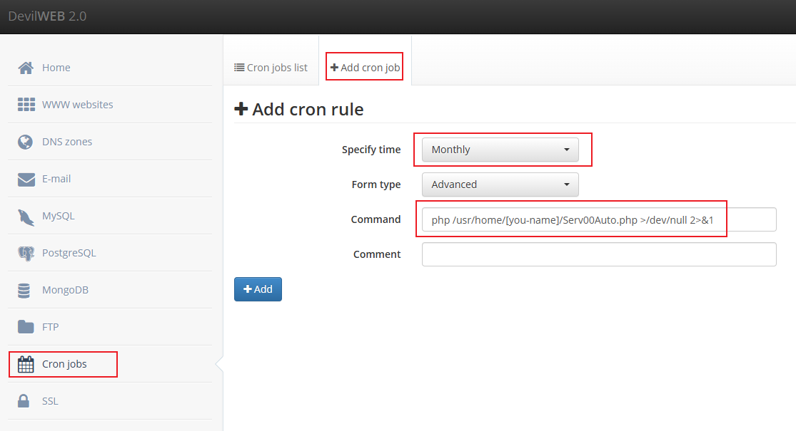

# Serv00.com 免费VPS 保号脚本

Serv00.com 10年有效期免费VPS，要求90内至少登陆一次(主机面板或SSH)要么就被删号。

账号申请： https://www.serv00.com/ （申请教程请自行搜索）
SSH登陆IP解锁： https://www.serv00.com/ip_unban/

## 使用方法
1. 把 Serv00Auto.php 下载到你的 serv00 主机上
2. 修改 USERNAME 与 PASSWORD 为你的账号与密码等
3. SSH 下执行 php Serv00Auto.php 测试一下是否可用
4. 登陆主机面板, 在 https://panel5.serv00.com/cron/add 中添加计划任务, 如图:

``` shell
# 路径请自行修改
php /usr/home/[you-name]/Serv00Auto.php >/dev/null 2>&1
```
5. 每月的会登陆一次然后给你发邮件(如果设置)
